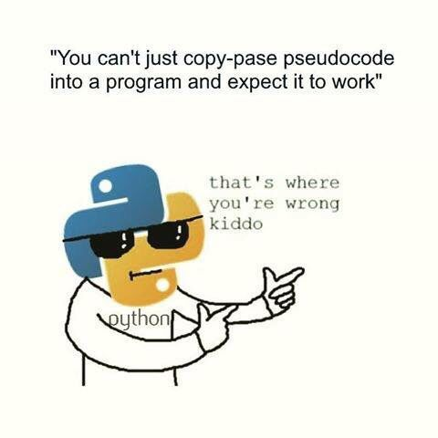

# MATH 1MP3 Fall 2019 

Welcome to math 1mp3. This directory contains all the notes, presentations and lectures I will use throughout the semester. 

## Programming Language 

The language that we will be using is Python 3. Note that Python 3 is different from Python 2. Python is an easy to use, general purpose, interpreted language. 

## Tutorial Sections 

Here are the other tutorial sections, feel free to go to any other ones. 
Only exception, you are required to go to your own section. when there is a quiz, or test handout.

- Steve  L01      Mo      10.30   11.20   JHE_233A/234
- Steve  L02      We      12.30   13.20   JHE_233A/234
- Steve  L05      Mo      12.30   13.20   JHE_233A/234
- Nik    L03      Mo      09.30   10.20   JHE_233A/234
- Nik    L04      Tu      11.30   12.20   JHE_233A/234

## Emailing Etiquette

When emailing me, Steve, or Dr. Bolker please show proper email etiquette. Title your emails in such a way that we know the following: 

- “1MP3” in the subject. Include your Mac ID and student ID, and your (lecture and/or tutorial) section in the body of the e-mail.
- what the reason is for your email 
- which section you are in

### DOS:
- use "Dear" at the beginning ie. "Dear Nik, " 
- Send screen capture pictures, python files, or notebooks of code. 

### DONTS: 
- DONT COPY PASTE CODE IN THE EMAIL, IT DONT FORMAT RIGHT!
-  Dont be like these people https://www.buzzfeed.com/ryanschocket2/sixteen-professors-who-answered-emails-in-the-most-savage

## Adjustment of Marks 

Marks can be adjusted in this class. 

If you follow the correct steps I will be happy to adjust your mark on tests, and assignments. If you deviate from the steps, I can still adjust them, however I will be less LIKELY to. :) 

1. Upon recieving the test or assignments, go home and look at it carefully. Spend some time going over each mistake and compare it with the solutions. 

2. If you are sure that you deserve some extra marks; send me an email saying you would like mark adjusted  in one of the tutorials, and SPECIFY which one. Come early to the tutorial class, and I will look over your work. 

Here are some EXCEPTIONS. 
- If you used pen or marker on your assignments or tests, you can take it home, and have it adjusted at a later date. 
- If you use pencil, you can take it home, but I will not be allowed to adjust it. HOWEVER, you can take pictures of your work to review, leave the test with a TA, and then have your mark adjusted later. 
